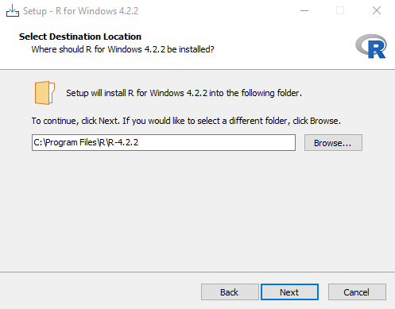
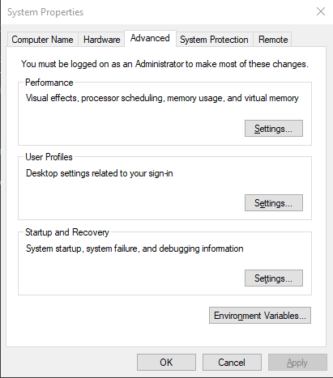
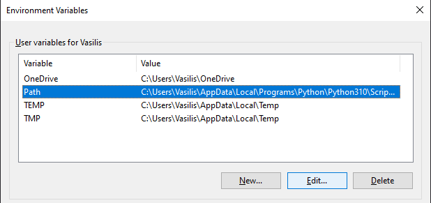

<p align="center">
    The Sherlock of Outbreak Simulator Games
</p>

# Our Team

* Dennis Mbuthia (Project Manager)
* Guanyi Xiao (Game Designer)
* Jakkapan Chainilwan (Artist)
* Miguel Campello (Programmer)
* Petter Tveit (Programmer)
* Shane Strander (Programmer)
* Vasileios Mormoris (Programmer)

# Prerequisites

The game uses an R model that was provided to us by the SVA. So in order to be able to play the game you need to have R installed and be able to run it from the command line.

### **1st Step (Installing R)**
To install R just download the setup executable from their [website](https://cran.r-project.org/bin/windows/base/). While installing R remember to store the folder where you will be installing it, because you will need it for the next step.

<p align="center">
    <br>
    <b>Figure 1</b> - <i>Destination where R will be installed</i>
</p>

### **2nd Step (Setting up the Enviroment Variable)**

After installing R you have to tell your operating system the folder that is installed on, so it knows that it needs to search it when entering the command. To do this simply type: `Edit environment variables for your account` on the Windows searchbar and press enter. The window bellow should appear:

<p align="center">
    <br>
    <b>Figure 2</b> - <i>System properties window</i>
</p>

Click the button `Environment Variables` and then Select the `Path` Variable and Press the button Edit:

<p align="center">
    <br>
    <b>Figure 3</b> - <i>Enviroment Variables</i>
</p>

Press the `New` button and enter the path you install R earlier while appending `\bin` and press `Ok` and `Apply` until all windows closes. As an example for the path that shows on Figure 1 you should type: `C:\Program Files\R\R-4.2.2\bin`. To make sure that R and the Enviroment Variables are setup correctly open the command line and press:
```cmd
Rscript --version
```

### 3rd Step (Install the FMD model)

Assuming that you are done with the previous steps this will be very easy you just need to open the command line and use this command:

```cmd
Rscript -e "install.packages('game.FMD', repos=c('https://SVA-SE.github.io/game.FMD', 'https://cloud.r-project.org/'))"
```

# Third Party Libraries

[UnitySQLite](https://github.com/coryleach/UnitySQLite)